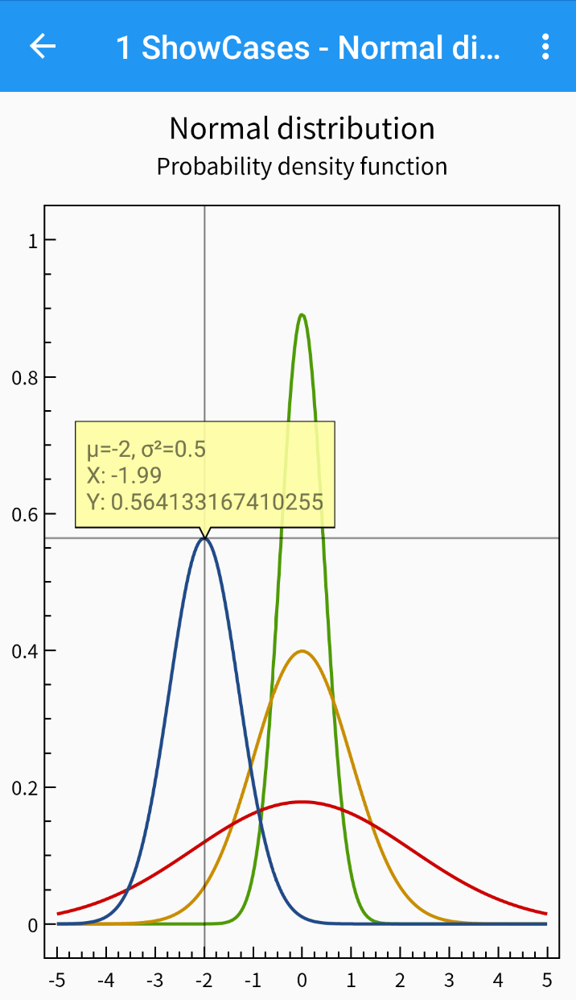

OxyPlot is a cross-platform plotting library for .NET

This repository contains the Xamarin.Forms.Android implementation with SkiaSharp base on [OxyPlot.SkiaSharp.Wpf](https://github.com/oxyplot/oxyplot/tree/develop/Source/OxyPlot.SkiaSharp.Wpf) 

For more information go to [Official implementation](https://github.com/oxyplot/oxyplot-xamarin)

#### Examples

You can find examples in the `/Source/Examples` folder in the code repository.

